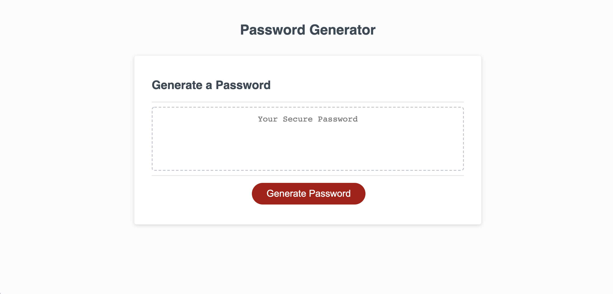

## Random Password Generator

In this assignment, a random password generator was created. The generator prompts the user to choose password length, and which types of characters they would like the password to contain. The user choices are validated to confirm that they match the required parameters for password length, and the need for at least one type of character to be selected. Once the password has been generated, it will appear on the screen.

## Completed Assignment

This image shows the completed assignment's appearance, and functionality:

## Link to Deployed Site

https://knolan18.github.io/3-Password-Generator/
